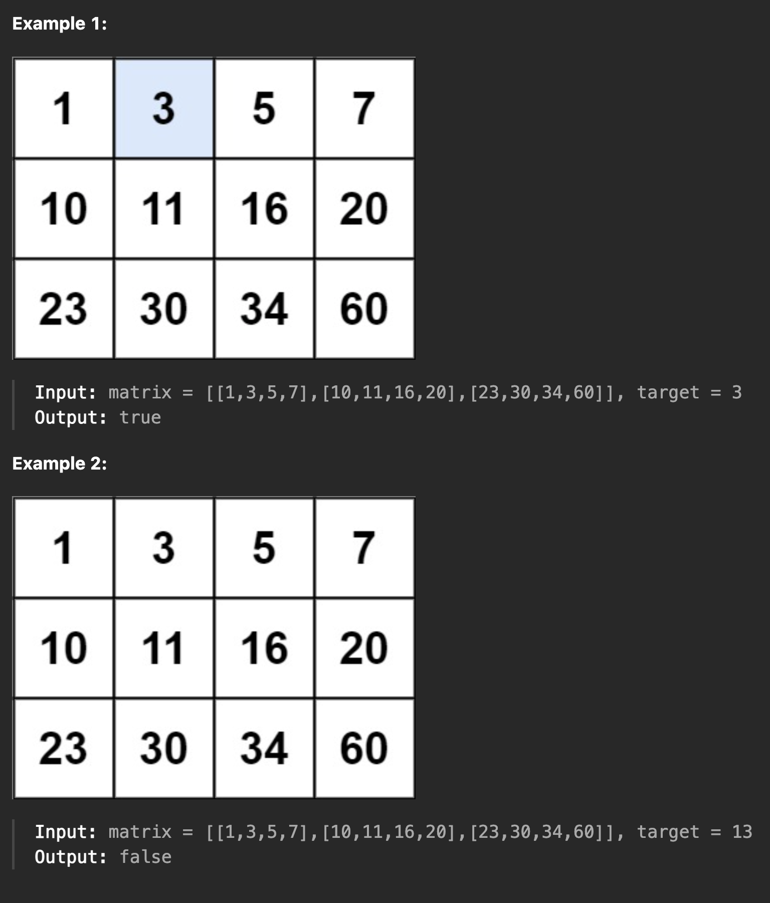

[74. Search a 2D Matrix](https://leetcode.com/problems/search-a-2d-matrix/)

1. 문제

   > 다음 두 가지 속성을 갖는 2차원 정수 배열이 제공됩니다.
   >
   > - 각 행은 오름차순으로 정렬 되어진 상태입니다.
   > - 각 행의 첫 번째 정수는 이전 행의 마지막 정수보다 큽니다.
   >

   > 정수 대상이 주어지면 대상이 행렬에 있으면 true를 반환하고 그렇지 않으면 false를 반환합니다.
   > O(log(m * n)) 시간 복잡도로 솔루션을 작성해야 합니다.
   >

   
2. 문제 분석

   - 2차원 배열에서 target 값을 찾아 true를 반환하고, 없다면 false를 반환하는 문제다.
   - 위 이미지의 예제와 같이 2차원 배열의 모든 행을 순회하며 target을 찾는 것이 가장 쉬운 방법이나 이는 시간 제한 초과로 통과하지 못할 것이다.
   - 이 문제는 `O(log(m * n))` 시간 복잡도로 해결해야 한다.
   - 문제의 제약 사항에서 배열의 크기를 나타낼 m, n은 `1 <= m, n <= 100`로 제공 된다.
   - 따라서 가장 큰 배열이 주어질 경우 배열의 크기는 다음과 같다.
     - `matrix[100][100]`
     - `10,000 = 100 * 100` 
   - 즉 최대 1만 번의 요소를 전체 확인하지 않고 target이 존재할 행을 찾은 후 그 행을 탐색하면 될 것이다.

3. 풀이 과정
   - 우선 배열의 모든 요소를 탐색하여 target의 존재유무를 반환하는 코드를 작성하였다.
        ```java
        // 시간 복잡도 O(m*n)
        public boolean searchMatrix(int[][] matrix, int target) {
            for (int i = 0; i < matrix.length; i++) { // 1 ~ 100
                for (int j = 0; j < matrix[i].length; j++) { // 1 ~ 100
                    if (matrix[i][j] == target) {
                        return true;
                    }
                }
            }
            return false;
        }
       ```
   - 이 코드로 모든 테스트 케이스에서 정확도는 해결할 수 있으나 효율성의 문제로 위 분석처럼 시간 제한 초과로 실패 하기 때문에 이 코드의 시간 복잡도를 개선 해야한다.
   - 문제 분석처럼 시간 복잡도를 해결하기 위해 `이진 탐색` 알고리즘 적용이 알맞아 보이지만 2차원 배열에 접근해야 하기 때문에 다음과 같은 계획을 세웠다.
     1. target이 존재할 행을 찾는다.
     2. 찾은 행에서 target을 찾는다.
   - 우선 계획[1]은 target이 다음과 같은 조건에 부합하는 행을 순차적으로 찾는다.
     - target <= matrix[?][마지막 요소]
     - 예를 들어 위 문제의 `Example 2`처럼 Target이 13인 경우에는 범위가 10 ~ 20인 matrix[1]을 찾는다.
   - 다음으로 찾은 행에서 target과 같은 값을 찾는데 이 경우 `이진 탐색`을 하고 target과 동일한 값이 있다면 바로 true를 반환하고 해당 행을 전체 탐색 했음에도 없다면 false를 반환한다.
     ```java
        // 전체 시간 복잡도 O(m * log n)
        public boolean searchMatrix(int[][] matrix, int target) {
            for (int i = 0; i < matrix.length; i++) { // 부분 시간 복잡도 1 - O(n)
                int[] arr = matrix[i];
                // 1. 각 행의 마지막 요소가 target 보다 크거나 같은 경우 true
                if (target <= arr[arr.length - 1]) {
                    int left = 0;
                    int right = arr.length - 1
                    // 2. 이진 탐색 하여 target 찾기
                    while (left <= right) { // 부분 시간 복잡도 2 - O(log n)
                        int mid = (left + right) / 2;
                        if (arr[mid] == target) { // target이 있는 경우
                            return true;
                        } else if (arr[mid] < target) {
                            left = mid + 1;
                        } else {
                            right = mid - 1;
                        }
                    }
                    return false; // 없는 경우 다른 행을 찾아볼 필요 없이 false 반환
                }
            }
            return false;
       }
       ```
     - 위 코드로도 문제는 통과 했지만 이 코드의 시간 복잡도는 `O(m * log n)`으로 비효율적이며 `O(log(m * n))`에 부합하지도 않는다.
     - for 반복문 사용 부분이 시간 복잡도 `O(n)`으로 이 부분은 최대 n만큼 순회하기 때문에 이 문제의 제약은 1~100까지 주어지지만 만약 훨씬 큰 제약이 주어진다면 이 부분에서 효율성 문제가 발생할 것이다.
     - 따라서 이 for 동작 부분 또한 `O(n)` -> `O(log n)` 으로 변경하여 최종적으로 코드를 작성 하였다.
6. 최종 코드
    ```java
    // 전체 시간 복잡도 `O(log(m*n))`
    public boolean searchMatrix2(int[][] matrix, int target) {
        int m = matrix.length;
        int n = matrix[0].length;
        int left = 0;
        int right = m - 1;
        while (left <= right) { // `O(n)` -> `O(log n)` 변경함으로 시간 복잡도 개선
            int mid = (left + right) / 2;
            if (target > matrix[mid][n - 1]) {
                left = mid + 1;
            } else if (target < matrix[mid][0])  {
                right = mid - 1;
            } else {
                int[] arr = matrix[mid];
                if (target <= arr[n - 1]) {
                    int innerLeft = 0;
                    int innerRight = n - 1;
                    while (innerLeft <= innerRight) { // `O(log n)`
                        int innerMid = (innerLeft + innerRight) / 2;
                        if (arr[innerMid] == target) {
                            return true;
                        } else if (arr[innerMid] < target) {
                            innerLeft = innerMid + 1;
                        } else {
                            innerRight = innerMid - 1;
                        }
                    }
                    return false;
                }
            }
        }
        return false;
    }
    ```
5. 후기
    > 최종적으로 작성한 코드는 두 단계의 이진 탐색을 통해 target을 찾는데 이렇게 나누었던 것은 2차원 배열이었기 때문이다. 
   > 하지만 전체적으로 값이 정렬된 상태이기 때문에 행렬의 인덱스 접근만 잘하면 2차원 배열 전체를 1차원 배열처럼 탐색하여 한 단계의 이진탐색으로도 결과를 찾아낼 수도 있었는데 이를 구현하지 못했던 것은 배열 탐색에 있어 `/`, `%`과 같은 연산 활용이 부족했던 것 같은데 이에 대한 학습과 개선이 필요할 것 같다.